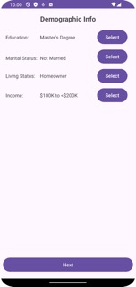

# User Profile Android App README

## Introduction
This Android application is designed to collect user information through a series of activities, including Identification, Demographic, and Profile activities. The application guides the user through inputting various personal details and displays the collected information in the Profile activity.

## Usage
1. Launch the app on your Android device.
2. The Welcome screen will display a welcome photo. Click the "Start" button to begin.
3. The Identification activity will prompt you to enter your name, email, and role. Ensure all fields are filled correctly, and click "Next" to proceed.
4. If any input is missing or invalid, appropriate Toast messages will be displayed.
5. After providing valid inputs, the Demographic activity will be launched.
6. In the Demographic activity, you'll be asked to provide details such as education level, marital status, living status, and annual income.
7. For education level, click the "Select" button to launch the Select Education activity. Choose your education level from the provided options and click "Submit".
8. For marital status, living status, and income level, similar actions are required to select the appropriate options.
9. Once all details are provided, the Profile activity will display the collected information.

## Components
### Identification Activity
- Requests user's name, email, and role.
- Validates inputs and displays Toast messages for invalid inputs.
- Sends validated data to the Demographic activity.

### Demographic Activity
- Requests additional user information including education level, marital status, living status, and annual income.
- Receives data from the Identification activity.
- Launches Select Education, Select Marital Status, Select Living Status, and Select Income activities for specific inputs.
- Displays selected values and sends the complete Response object to the Profile activity.

### Select Education Activity
- Allows users to select their education level from provided options.
- Sends the selected education level back to the Demographic activity.

### Select Marital Status Activity
- Allows users to select their marital status from provided options.
- Sends the selected marital status back to the Demographic activity.

### Select Living Status Activity
- Allows users to select their living status from provided options.
- Sends the selected living status back to the Demographic activity.

### Select Income Activity
- Allows users to select their income level using a slider.
- Converts slider value to income level.
- Sends the selected income level back to the Demographic activity.

### Profile Activity
- Receives the complete Response object from the Demographic activity.
- Displays all collected user information.

## Screenshots

        

        

        

## Dependencies

- No external dependencies required.

## Installation

- Clone the repository.
- Open the project in Android Studio.
- Build and run the project on an Android device or emulator.

## Author

Jaya Sravani Sirigineedi

## Acknowledgments

- This app was created as part of Mobile Application Development course at UNCC.
